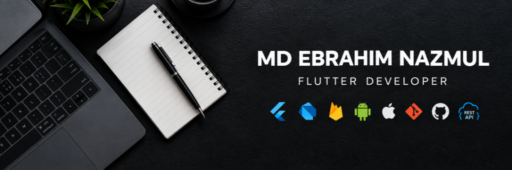

<div align="center">



</div>

<br/>

<div align="center">

### 📱 Flutter Developer · Building Production Mobile Apps End-to-End

**Cross-Platform (Android & iOS) · Scalable Architecture · Store Release & Compliance**

<p align="center">


</p>

<p align="center">

<a href="https://github.com/onionroots">

</a>

<a href="#">

</a>

<a href="mailto:">

</a>

</p>

</div>

---

## 👨‍💻 About Me

I'm a **Flutter Developer** at **Sparktech Agency**, Dhaka. I build and ship cross-platform mobile apps for **Android & iOS**, from development to store release and compliance.

I focus on clean architecture, responsive UI, state management, real-time features, and production-ready mobile experiences.

```text
🔭 Currently Building    Production mobile apps across diverse client & enterprise domains

🌱 Currently Exploring   Riverpod architecture & advanced performance profiling

🛠 Core Daily Stack      Flutter · Dart · GetX · Firebase · REST APIs · Socket.IO · Maps

📦 Shipped To            Google Play Store & Apple App Store

⚡ Philosophy            "Pixel-perfect UI meets bulletproof architectural foundation"
```

---

## 🛠 Tech Stack & Architecture

<table>
<tr>

<td valign="top" width="50%">

### 💻 Core & Frameworks

<p>


</p>

### ⚙️ State Management

<p>


</p>

</td>

<td valign="top" width="50%">

### 🌐 Real-Time & Backend

<p>


</p>

### 💳 Payments, Maps & Tools

<p>


</p>

</td>

</tr>
</table>

### 🏗 Architecture Pattern

```text
UI (Views & Custom Widgets)
        ↕
GetX Controller / Cubit
        ↕
Repository Layer
        ↕
ApiClient (Dio) / WebSockets
        ↕
Models
```

* **Folder Architecture:** Feature-first modular structure
* **Design System:** Reusable custom components and shared UI widgets

---

## 🚀 Featured Projects

### 🏥 **Permawell Health Care**

**Doctor Appointment & Telehealth Platform**

Healthcare app for doctor discovery, appointment booking, payments, and patient-doctor messaging.

**Tech:** `Flutter` `GetX` `Firebase` `REST API` `Payment Gateway`

---

### 📦 **MileSquad**

**Parcel Delivery Platform**

Two-sided delivery system with Customer & Rider apps, live GPS tracking, route navigation, and chat.

**Tech:** `Flutter` `GetX` `Socket.IO` `Google Maps` `Firebase FCM` `REST API`

---

### ⚖️ **Panama Legal**

**Legal Consultation & Law Library**

Legal platform with lawyer consultations, real-time chat, automated triage, and searchable legal documents.

**Tech:** `Flutter` `GetX` `Socket.IO` `Syncfusion PDF` `Dio`

---

### 📍 **Just Clicker**

**Proximity-Based Social Network**

Location-based social app with nearby user discovery, messaging, notifications, subscriptions, and ads.

**Tech:** `Flutter` `GetX` `FCM` `IAP` `Stripe` `Google Play` `App Store`

---

### 🍔 **Brain Denner**

**Nutrition & Meal Tracker**

Lifestyle app for restaurant discovery, meal tracking, and personalized nutrition insights.

**Tech:** `Flutter` `GetX` `Dio` `REST API` `Cached Network Image`

---

## 📬 Let's Connect & Build Together

I'm actively open to **Flutter Developer roles (Full-time / Remote)** and exciting **freelance mobile projects**.

Let's talk about your next app!

<div align="center">

<br/><br/>

<code><b>💡 "Eat → Code → Sleep → Repeat" 🚀</b></code>

</div>
